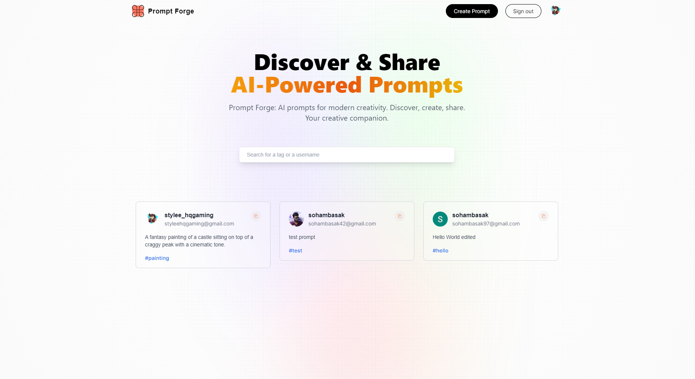

# Prompt Forge


Prompt Forge is an open-source AI prompting tool for creative minds. This website is built with Next.js and MongoDB.

# Prompt Forge Website



## Live Demo

You can explore Prompt Forge live by visiting the following link:

[Live Demo](https://prompt-forge-bydex.vercel.app/)

Feel free to create an account and experience the creativity firsthand!

## Features

- Discover creative prompts.
- Create and share your own prompts.
- Built with Next.js and MongoDB.
- [Add any additional features here]

## Getting Started

### Prerequisites

Before running this project locally, ensure you have the following installed:

- Node.js and npm (Node Package Manager)
- MongoDB (You can use a local MongoDB installation or a cloud-based MongoDB service like MongoDB Atlas)

### Installation

1. Clone this repository:

   ```bash
   https://github.com/soham-basak/Prompt-Forge.git

   ```

2. Change into the project directory

   ```bash
   cd prompt-forge

   ```

3. Install the project dependencies:

   ```bash
   npm install

   ```

4. Create a .env.local file in the root directory of the project and configure your MongoDB connection URI and Secret keys

5. Start the development server:

   ```bash
   npm run dev
   ```

## Authors

- [Dexter](https://github.com/soham-basak)
